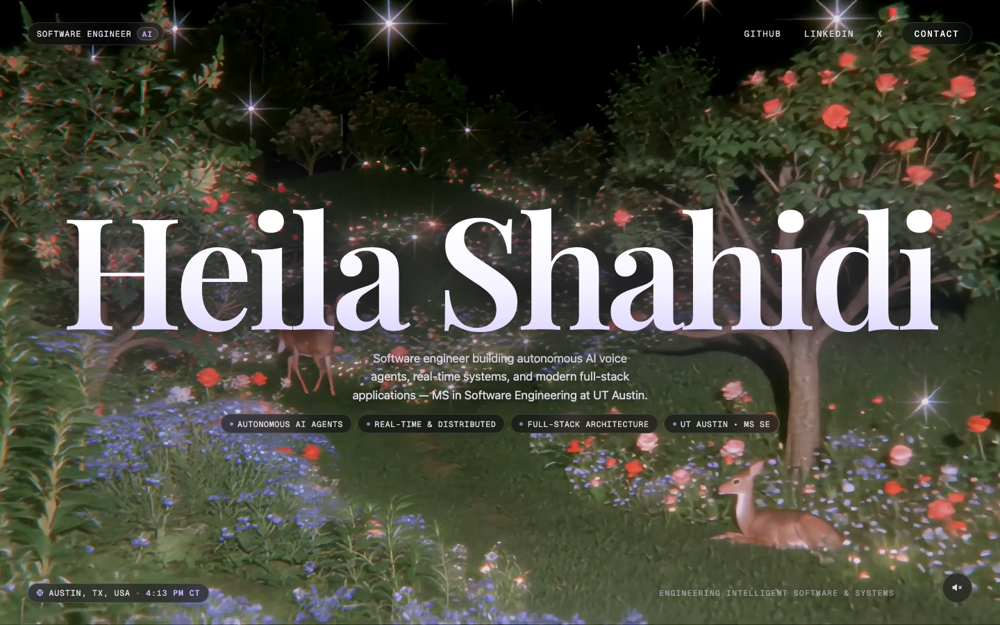

# Heila Shahidi

A cinematic, modern single-page hero portfolio for software engineer **Heila Shahidi**.

Live at **[heilas.co](https://heilas.co)** and **[heilas.tech](https://heilas.tech)**.



## Overview

- **Typography**: Monumental display serif in Playfair Display (semi-bold 600) with atmospheric drop-shadow and moonlit gradient sheen.
- **Cinematics**: Continuous unpausable looping background video with default audio playback and frosted-glass audio toggle.
- **Interactive Competencies**: Responsive chip deck featuring autonomous AI voice agents, real-time distributed systems, full-stack architecture, and graduate studies at UT Austin.
- **Micro-Delights**: Real-time Austin Central Time badge subscribing via React 19's `useSyncExternalStore` with coordinate toggle.
- **Design System**: Meta StyleX for zero-runtime, type-safe atomic CSS with strict viewport bounds.
- **Verification**: 100% deterministic test suite with Vitest unit tests and Playwright multi-viewport end-to-end coverage (320px–1440px).

## Connect

- **Live**: [https://heilas.co](https://heilas.co) • [https://heilas.tech](https://heilas.tech)
- **GitHub**: [https://github.com/heilashahidi](https://github.com/heilashahidi)
- **LinkedIn**: [https://www.linkedin.com/in/heilashahidi/](https://www.linkedin.com/in/heilashahidi/)
- **X**: [https://x.com/h3ilaa](https://x.com/h3ilaa)

## Stack

- **Framework**: Next.js 16 (App Router, Turbopack)
- **Styling**: Meta StyleX (`@stylexjs/stylex`)
- **Runtime**: Bun
- **Testing**: Vitest, React Testing Library, Playwright
- **Deployment**: Vercel Edge Network

## Development

```bash
bun install
bun run dev
```

Preview runs locally at `http://localhost:3000` (or `http://localhost:3001` if port 3000 is in use).

## Verification

Execute the full verification gate (formatting, linting, typechecking, unit tests, production build, and E2E):

```bash
bun run check
```
